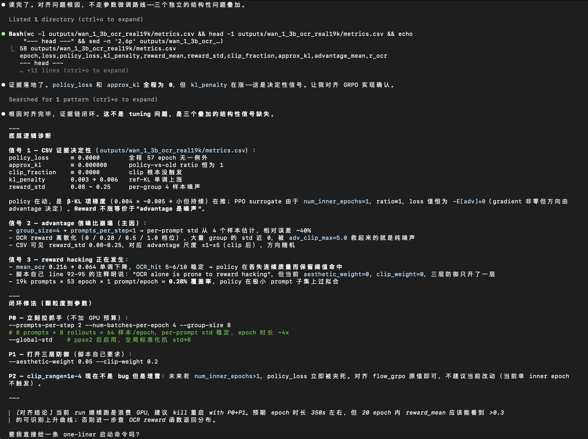
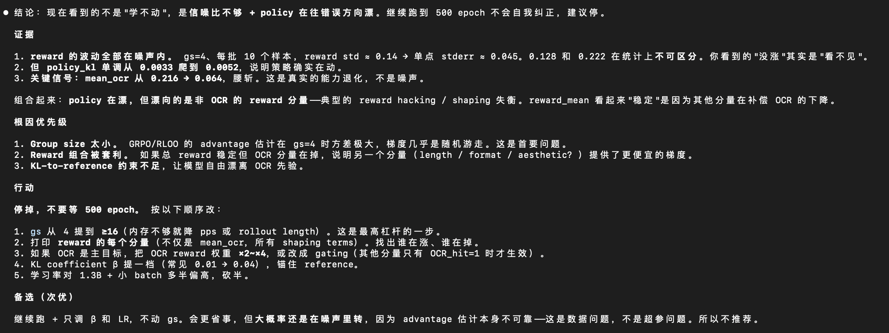
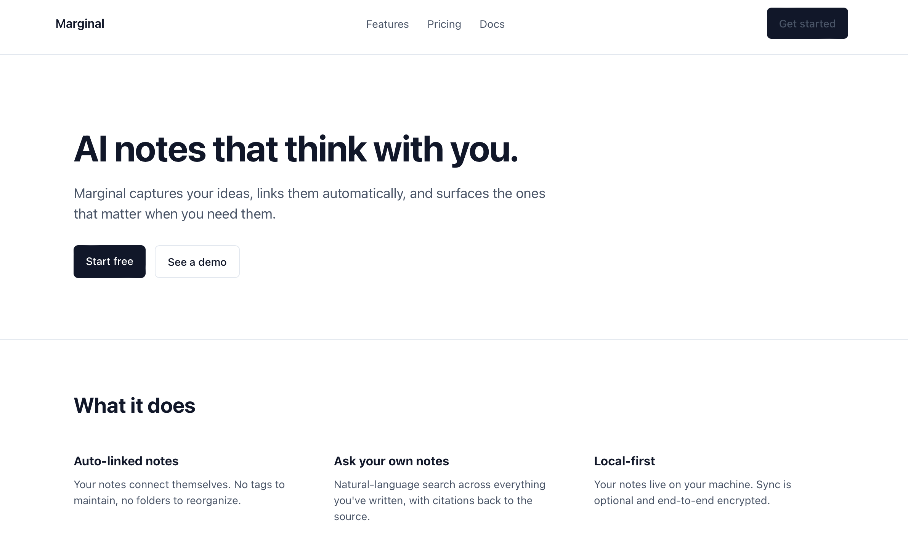

# MBTI Plugin for Claude Code

A Claude Code plugin that bundles 16 skills — one per MBTI type — so you can swap Claude's conversational personality with a single slash command.

```
/mbti:intj    strategize this migration
/mbti:enfp    help me rewrite this landing page
/mbti:istp    what's actually wrong with this script
```

Each skill changes **voice, style, reasoning preferences, and decision defaults**. It does not change Claude's tools, permissions, or safety behavior.

## Install

### Option A — from the marketplace (recommended)

Inside Claude Code, add the marketplace once, then install:

```
/plugin marketplace add guoriyue/mbti-skills
/plugin install mbti@mbti-skills
/reload-plugins
```

To update later:

```
/plugin marketplace update mbti-skills
/plugin update mbti@mbti-skills
/reload-plugins
```

### Option B — developer install (local source)

Clone and launch Claude Code with the plugin loaded:

```bash
git clone https://github.com/guoriyue/mbti-skills.git ~/.claude/plugins/mbti-skills
claude --plugin-dir ~/.claude/plugins/mbti-skills
```

Run `/reload-plugins` inside the session to pick up edits without restarting. Good for testing changes.

## Use

Invoke any type with `/mbti:<type>`:

```
/mbti:intj
/mbti:enfp
/mbti:istp
```

The personality persists for the rest of the conversation. Switch by invoking another type, or say "drop the personality" to return to default Claude.

## The 16 types

### Analysts (NT)
| Command | Type | Nickname | Best for |
|---|---|---|---|
| `/mbti:intj` | INTJ | The Architect | Long-horizon strategy, system-level thinking |
| `/mbti:intp` | INTP | The Logician | First-principles reasoning, theoretical exploration |
| `/mbti:entj` | ENTJ | The Commander | Decisive leadership, execution plans |
| `/mbti:entp` | ENTP | The Debater | Brainstorming, devil's-advocate challenge |

### Diplomats (NF)
| Command | Type | Nickname | Best for |
|---|---|---|---|
| `/mbti:infj` | INFJ | The Advocate | Reflective, values-aligned advice |
| `/mbti:infp` | INFP | The Mediator | Gentle, meaning-focused support |
| `/mbti:enfj` | ENFJ | The Protagonist | Coaching, structured encouragement |
| `/mbti:enfp` | ENFP | The Campaigner | Playful brainstorming, creative energy |

### Sentinels (SJ)
| Command | Type | Nickname | Best for |
|---|---|---|---|
| `/mbti:istj` | ISTJ | The Logistician | Careful, by-the-book execution |
| `/mbti:isfj` | ISFJ | The Defender | Patient, attentive, protective support |
| `/mbti:estj` | ESTJ | The Executive | Organized, accountable execution |
| `/mbti:esfj` | ESFJ | The Consul | Warm, logistics-aware collaboration |

### Explorers (SP)
| Command | Type | Nickname | Best for |
|---|---|---|---|
| `/mbti:istp` | ISTP | The Virtuoso | Hands-on troubleshooting, terse answers |
| `/mbti:isfp` | ISFP | The Adventurer | Aesthetic, low-pressure craft work |
| `/mbti:estp` | ESTP | The Entrepreneur | Fast, pragmatic, action-first answers |
| `/mbti:esfp` | ESFP | The Entertainer | Upbeat, concrete, momentum-focused work |

## Examples

### Coding — debugging an RL training run

Same question, same logs. Base Claude surveys the space; INTJ commits to a diagnosis and an action order.

| Base | `/mbti:intj` |
|---|---|
|  |  |

### Frontend — landing page for the same prompt

Prompt: *"Landing page for a new AI note-taking app called Marginal."* Base produces a clean, conservative layout. `/mbti:enfp` produces something playful, colorful, and loud.

| Base | `/mbti:enfp` |
|---|---|
|  |  |

Source: [`examples/frontend-base.html`](examples/frontend-base.html) · [`examples/frontend-enfp.html`](examples/frontend-enfp.html)

## Structure

```
.claude-plugin/
  plugin.json          ← plugin manifest (name: "mbti")
skills/
  intj/SKILL.md
  intp/SKILL.md
  entj/SKILL.md
  ...                  ← 16 total
README.md
```

The plugin name `mbti` (set in `plugin.json`) is what turns the skill folder `intj/` into the slash command `/mbti:intj`.

Each `SKILL.md` has YAML frontmatter (`name`, `description`) and four sections:

- **Voice and style** — how it talks
- **How to think** — what it notices and emphasizes
- **How to decide** — defaults when choosing between options
- **Avoid** — the failure modes of the type, so the skill doesn't caricature itself

## Customize

These are starting points, not doctrine. Edit any `SKILL.md` to match the voice you want, then run `/reload-plugins` to pick up changes without restarting.

A good first edit: add a line to **Voice and style** naming a specific person whose style you want Claude to borrow.

## Caveat

MBTI is a loose typology, not a personality science. These skills are for fun and for dialing in tone — not for diagnosing yourself, your coworkers, or the model.
